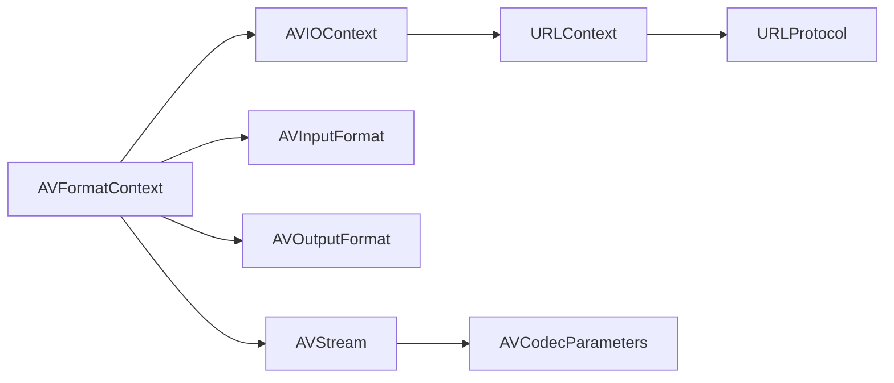
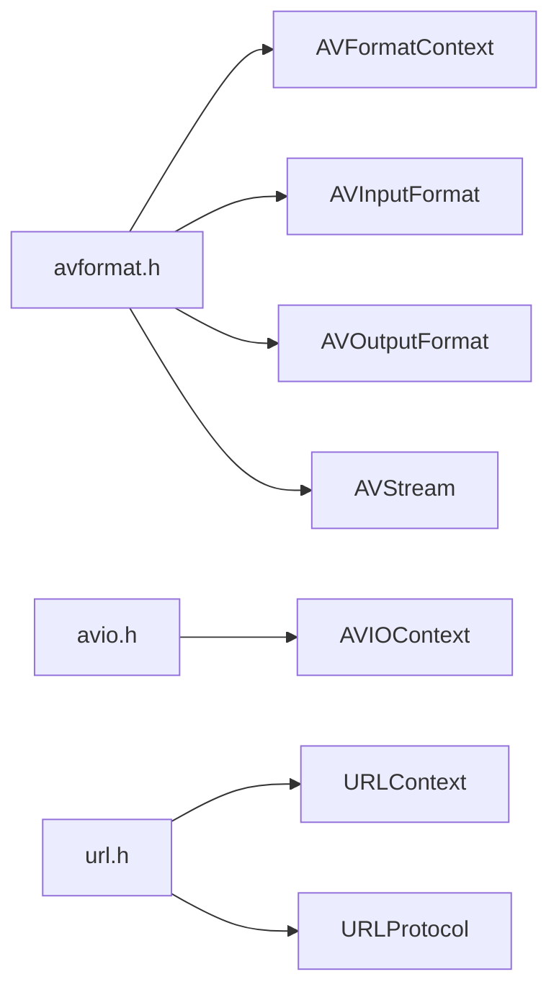
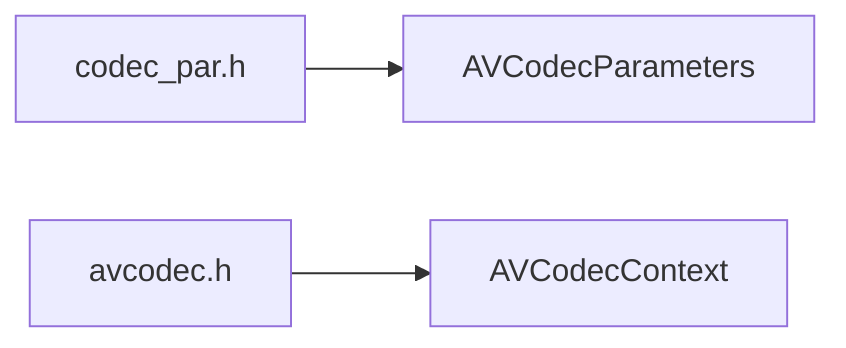
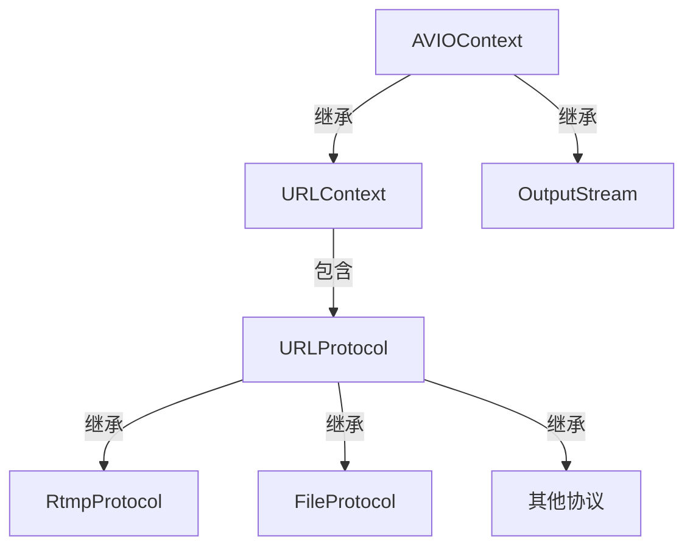
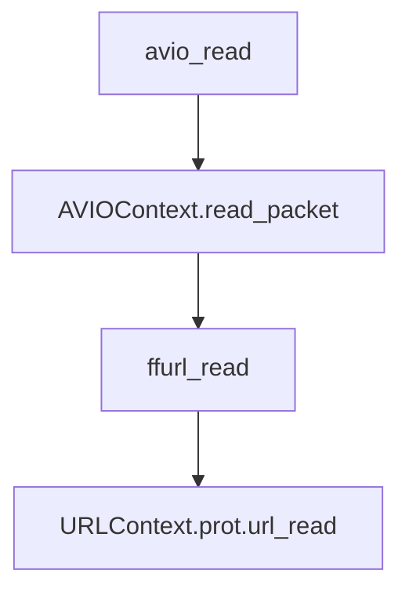
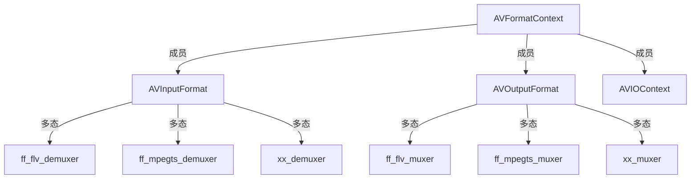

## avformat头文件


## avcodec头文件



# AVIOContext

## 关系

### 类图



### 使用c++表示

```cpp
class IOBase
{
public:
    virtual int read_packet() = 0;
    virtual int write_packet() = 0;
}

class URLProtocolBase
{
public:
    virtual int url_open() = 0;
    virtual int url_close() = 0;
    virtual int url_read() = 0;
    virtual int url_write() = 0;

private:
    const char *name;
}

class URLContext : public IOBase
{
public:
    int read_packet() override{
        return prot_->url_read();
    };
    int write_packet() override{
        return prot_->url_write();
    };
private:
    URLProtocolBase *prot_;
    void *priv_data_;
    char *filename_;
    ...
}

class StreamOutput : public IOBase
{
public:
    int read_packet() override{
        // 具体实现... 
    };
    int write_packet() override{
        // 具体实现... 
    };
private:
    int bitrate;
    int first_stream;
    ...
}

class AVIOContext
{
public:
    int read_packet(){
        io_->read_packet();
    };
    int write_packet(){
        io_->write_packet();
    }
private:
    /*  IOBase是使用多态来实现下面这段c代码
        void *opaque;         
        int (*read_packet)(void *opaque, uint8_t *buf, int buf_size);
        int (*write_packet)(void *opaque, uint8_t *buf, int buf_size);
    */
   IOBase *io_;  
   uint8_t *buffer_;     
   int buffer_size_;
   ...
}
```

使用URLProtocol时，读取调用的路径为:



## AVIOContext

### 使用场景

- 解封装：使用者在avformat_open_input()之前给定，或者avformat_open_input()给定。
- 封装：使用者在avformat_write_header()之前给定。

### 操作接口

- `avio_alloc_context`
- `avio_context_free`
- `avio_write`
- `avio_open`
- `avio_open2`
- `avio_close`
- `avio_seek`
- `avio_read`
- `avio_flush`
- ...

### 公开结构

```c
#include "libavformat/avio.h"
```

```c
typedef struct AVIOContext {

    const AVClass *av_class;
    unsigned char *buffer; 
    int buffer_size;   
    unsigned char *buf_ptr; 
    unsigned char *buf_end; 
    void *opaque;         
    int (*read_packet)(void *opaque, uint8_t *buf, int buf_size);
    int (*write_packet)(void *opaque, uint8_t *buf, int buf_size);
    int64_t (*seek)(void *opaque, int64_t offset, int whence);
    int64_t pos;   
    int eof_reached;    
    int error;         
    int write_flag;    
    int max_packet_size;
    int min_packet_size;  
    unsigned long checksum;
    unsigned char *checksum_ptr;
    unsigned long (*update_checksum)(unsigned long checksum, const uint8_t *buf, unsigned int size);
    int (*read_pause)(void *opaque, int pause);
    int64_t (*read_seek)(void *opaque, int stream_index, int64_t timestamp, int flags);
    int seekable;
    int direct;                    // 是否启用buffer对数据进行缓冲，如果启用buffer，read之前都会先调用fill_buffer对buffer进行填充
    const char *protocol_whitelist;
    const char *protocol_blacklist;
    int (*write_data_type)(void *opaque, uint8_t *buf, int buf_size, enum AVIODataMarkerType type, int64_t time);
    int ignore_boundary_point;
    unsigned char *buf_ptr_max;
    int64_t bytes_read;
    int64_t bytes_written;
} AVIOContext;
```

### 内部结构

```c
typedef struct FFIOContext {
    AVIOContext pub;
    int (*short_seek_get)(void *opaque);
    int short_seek_threshold;
    enum AVIODataMarkerType current_type;
    int64_t last_time;
    int64_t maxsize;
    int64_t bytes_read;
    int64_t bytes_written;
    int seek_count;
    int writeout_count;
    int orig_buffer_size;
    int64_t written_output_size;
} FFIOContext;
```

## URLContext

### 结构

```c
typedef struct URLContext {
    const AVClass *av_class;    /**< information for av_log(). Set by url_open(). */
    const struct URLProtocol *prot;
    void *priv_data;
    char *filename;             /**< specified URL */
    int flags;
    int max_packet_size;        /**< if non zero, the stream is packetized with this max packet size */
    int is_streamed;            /**< true if streamed (no seek possible), default = false */
    int is_connected;
    AVIOInterruptCB interrupt_callback;
    int64_t rw_timeout;         /**< maximum time to wait for (network) read/write operation completion, in mcs */
    const char *protocol_whitelist;
    const char *protocol_blacklist;
    int min_packet_size;        /**< if non zero, the stream is packetized with this min packet size */
} URLContext;
```

### 方法

- `ffurl_alloc`
- `ffurl_connect`
- `ffurl_open_whitelist`
- `ffurl_accept`
- `ffurl_handshake`
- `ffurl_read`：调用prot->url_read
- `ffurl_write`
- `ffurl_seek`

## URLProtocol

这是一个纯接口结构，不同的协议有不同的实现

### 结构

```cpp
typedef struct URLProtocol {
    const char *name;
    int     (*url_open)( URLContext *h, const char *url, int flags);
    int     (*url_open2)(URLContext *h, const char *url, int flags, AVDictionary **options);
    int     (*url_accept)(URLContext *s, URLContext **c);
    int     (*url_handshake)(URLContext *c);
    int     (*url_read)( URLContext *h, unsigned char *buf, int size);
    int     (*url_write)(URLContext *h, const unsigned char *buf, int size);
    int64_t (*url_seek)( URLContext *h, int64_t pos, int whence);
    int     (*url_close)(URLContext *h);
    int (*url_read_pause)(URLContext *h, int pause);
    int64_t (*url_read_seek)(URLContext *h, int stream_index,
                             int64_t timestamp, int flags);
    int (*url_get_file_handle)(URLContext *h);
    int (*url_get_multi_file_handle)(URLContext *h, int **handles,
                                     int *numhandles);
    int (*url_get_short_seek)(URLContext *h);
    int (*url_shutdown)(URLContext *h, int flags);
    const AVClass *priv_data_class;
    int priv_data_size;
    int flags;
    int (*url_check)(URLContext *h, int mask);
    int (*url_open_dir)(URLContext *h);
    int (*url_read_dir)(URLContext *h, AVIODirEntry **next);
    int (*url_close_dir)(URLContext *h);
    int (*url_delete)(URLContext *h);
    int (*url_move)(URLContext *h_src, URLContext *h_dst);
    const char *default_whitelist;
} URLProtocol;
```

### 实体

```c
extern const URLProtocol ff_async_protocol;
extern const URLProtocol ff_bluray_protocol;
extern const URLProtocol ff_cache_protocol;
extern const URLProtocol ff_concat_protocol;
extern const URLProtocol ff_concatf_protocol;
extern const URLProtocol ff_crypto_protocol;
extern const URLProtocol ff_data_protocol;
extern const URLProtocol ff_ffrtmpcrypt_protocol;
extern const URLProtocol ff_ffrtmphttp_protocol;
extern const URLProtocol ff_file_protocol;
extern const URLProtocol ff_ftp_protocol;
extern const URLProtocol ff_gopher_protocol;
extern const URLProtocol ff_gophers_protocol;
extern const URLProtocol ff_hls_protocol;
extern const URLProtocol ff_http_protocol;
extern const URLProtocol ff_httpproxy_protocol;
extern const URLProtocol ff_https_protocol;
extern const URLProtocol ff_icecast_protocol;
extern const URLProtocol ff_mmsh_protocol;
extern const URLProtocol ff_mmst_protocol;
extern const URLProtocol ff_md5_protocol;
extern const URLProtocol ff_pipe_protocol;
extern const URLProtocol ff_prompeg_protocol;
extern const URLProtocol ff_rtmp_protocol;
extern const URLProtocol ff_rtmpe_protocol;
extern const URLProtocol ff_rtmps_protocol;
extern const URLProtocol ff_rtmpt_protocol;
extern const URLProtocol ff_rtmpte_protocol;
extern const URLProtocol ff_rtmpts_protocol;
extern const URLProtocol ff_rtp_protocol;
extern const URLProtocol ff_sctp_protocol;
extern const URLProtocol ff_srtp_protocol;
extern const URLProtocol ff_subfile_protocol;
extern const URLProtocol ff_tee_protocol;
extern const URLProtocol ff_tcp_protocol;
extern const URLProtocol ff_tls_protocol;
extern const URLProtocol ff_udp_protocol;
extern const URLProtocol ff_udplite_protocol;
extern const URLProtocol ff_unix_protocol;
extern const URLProtocol ff_libamqp_protocol;
extern const URLProtocol ff_librist_protocol;
extern const URLProtocol ff_librtmp_protocol;
extern const URLProtocol ff_librtmpe_protocol;
extern const URLProtocol ff_librtmps_protocol;
extern const URLProtocol ff_librtmpt_protocol;
extern const URLProtocol ff_librtmpte_protocol;
extern const URLProtocol ff_libsrt_protocol;
extern const URLProtocol ff_libssh_protocol;
extern const URLProtocol ff_libsmbclient_protocol;
extern const URLProtocol ff_libzmq_protocol;
extern const URLProtocol ff_ipfs_protocol;
extern const URLProtocol ff_ipns_protocol;
```

### RTMP读取堆栈
RTMP基于TCP连接时，数据读取会一直调用到tcp_read

```
libavformat.so.59!tcp_read(URLContext * h, uint8_t * buf, int size) (\home\watt\learning_ffmpeg\ffmpeg-5.1\libavformat\tcp.c:238)
libavformat.so.59!retry_transfer_wrapper(URLContext * h, uint8_t * buf, int size, int size_min, int (*)(URLContext *, uint8_t *, int) transfer_func) (\home\watt\learning_ffmpeg\ffmpeg-5.1\libavformat\avio.c:370)
libavformat.so.59!ffurl_read_complete(URLContext * h, unsigned char * buf, int size) (\home\watt\learning_ffmpeg\ffmpeg-5.1\libavformat\avio.c:412)
libavformat.so.59!rtmp_packet_read_one_chunk(URLContext * h, RTMPPacket * p, int chunk_size, RTMPPacket ** prev_pkt_ptr, int * nb_prev_pkt, uint8_t hdr) (\home\watt\learning_ffmpeg\ffmpeg-5.1\libavformat\rtmppkt.c:199)
libavformat.so.59!ff_rtmp_packet_read_internal(URLContext * h, RTMPPacket * p, int chunk_size, RTMPPacket ** prev_pkt, int * nb_prev_pkt, uint8_t hdr) (\home\watt\learning_ffmpeg\ffmpeg-5.1\libavformat\rtmppkt.c:295)
libavformat.so.59!ff_rtmp_packet_read(URLContext * h, RTMPPacket * p, int chunk_size, RTMPPacket ** prev_pkt, int * nb_prev_pkt) (\home\watt\learning_ffmpeg\ffmpeg-5.1\libavformat\rtmppkt.c:159)
libavformat.so.59!get_packet(URLContext * s, int for_header) (\home\watt\learning_ffmpeg\ffmpeg-5.1\libavformat\rtmpproto.c:2420)
libavformat.so.59!rtmp_read(URLContext * s, uint8_t * buf, int size) (\home\watt\learning_ffmpeg\ffmpeg-5.1\libavformat\rtmpproto.c:2916)
libavformat.so.59!retry_transfer_wrapper(URLContext * h, uint8_t * buf, int size, int size_min, int (*)(URLContext *, uint8_t *, int) transfer_func) (\home\watt\learning_ffmpeg\ffmpeg-5.1\libavformat\avio.c:370)
libavformat.so.59!ffurl_read(URLContext * h, unsigned char * buf, int size) (\home\watt\learning_ffmpeg\ffmpeg-5.1\libavformat\avio.c:405)
libavformat.so.59!read_packet_wrapper(AVIOContext * s, uint8_t * buf, int size) (\home\watt\learning_ffmpeg\ffmpeg-5.1\libavformat\aviobuf.c:533)
libavformat.so.59!fill_buffer(AVIOContext * s) (\home\watt\learning_ffmpeg\ffmpeg-5.1\libavformat\aviobuf.c:577)
libavformat.so.59!avio_r8(AVIOContext * s) (\home\watt\learning_ffmpeg\ffmpeg-5.1\libavformat\aviobuf.c:635)
libavformat.so.59!flv_read_packet(AVFormatContext * s, AVPacket * pkt) (\home\watt\learning_ffmpeg\ffmpeg-5.1\libavformat\flvdec.c:1032)
libavformat.so.59!ff_read_packet(AVFormatContext * s, AVPacket * pkt) (\home\watt\learning_ffmpeg\ffmpeg-5.1\libavformat\demux.c:571)
libavformat.so.59!read_frame_internal(AVFormatContext * s, AVPacket * pkt) (\home\watt\learning_ffmpeg\ffmpeg-5.1\libavformat\demux.c:1245)
libavformat.so.59!av_read_frame(AVFormatContext * s, AVPacket * pkt) (\home\watt\learning_ffmpeg\ffmpeg-5.1\libavformat\demux.c:1450)
main(int argc, char ** argv) (\home\watt\learning_ffmpeg\self-project\av_read_frame.cc:62)
```


# Data Struct

## AVFrame

## AVPacket
```c
typedef struct AVPacket {
    AVBufferRef *buf;
    int64_t pts;
    int64_t dts;
    uint8_t *data;
    int   size;
    int   stream_index;
    int   flags;
    AVPacketSideData *side_data;
    int side_data_elems;
    int64_t duration;
    int64_t pos;                        
    void *opaque;
    AVBufferRef *opaque_ref;
    AVRational time_base;
} AVPacket;
```

## AVBufferRef / AVBuffer

```c
struct AVBuffer {
    uint8_t *data;          // 数据实际地址
    size_t size;            // 数据大小
    atomic_uint refcount;   // 引用计数
    void (*free)(void *opaque, uint8_t *data);      // 可以传入释放函数
    void *opaque
    int flags;
    int flags_internal;
};

typedef struct AVBufferRef {
    AVBuffer *buffer;
    uint8_t *data;          // 与buffer->data相同
    size_t   size;          // 与buffer->size相同
} AVBufferRef;
```
这两个结构类似于智能指针的实现，`AVBuffer`是内部结构，`AVBufferRef`是对其的包装。
对于同一个数据，`AVBuffer`只有一个实体，其data指向数据的开始地址。当添加引用时，创建`AVBufferRef`，并使`AVBuffer->refcount`加1。


# AVFormatContext

## 关系

### 类图

muxer与demuxer的实例可在`libavformat/allformats.c`中查看

### 使用c++类表示
```cpp
// 抽象接口类
class AVInputFormatBase
{
public: 
    virtual int read_probe() = 0;
    virtual int read_header() = 0;
    ...
private:
    const char *name;
    ...
}
// 子类实现
class MpegTsInputFormat : public AVInputFormatBase
{
public:
    int read_probe() override;
    int read_header() override;
}

// 抽象接口类
class AVOutputFormatBase
{
public:
    virtual int write_header() = 0;
    virtual int write_packet() = 0;
    ...
private:
    const char *name;
    ...
}

// 子类实现
class MpegTsOutputFormat : public AVOutputFormatBase
{
public:
    int write_header() override;
    int write_packet() override;
}

class AVFormatContext
{
public:
    AVInputFormatBase *input_fmt;       // 封装层方法使用抽象接口
    AVOutputFormatBase *output_fmt;     // 
    AVIOContext *pb;                    // io句柄放在外面,封装层可以使用:(AVFormatContext*)s->pb->read_packet()
    ...
private:
    unsigned int nb_streams;            // 成员自己保存
    AVStream **streams;
    char *url;
    ...
}
```

## AVFormatContext

### 结构
```c
typedef struct AVFormatContext {
    const AVClass *av_class;
    const struct AVInputFormat *iformat;
    const struct AVOutputFormat *oformat;
    void *priv_data;            // 挂着AVInputFormat或者AVOutputFormat的上下文结构体
                                // 比如对于ff_mpegts_demuxer，这里就挂着MpegTSContext
    AVIOContext *pb;
    int ctx_flags;
    unsigned int nb_streams;
    AVStream **streams;
    char *url;
    int64_t start_time;
    int64_t duration;
    int64_t bit_rate;
    unsigned int packet_size;
    int max_delay;
    int flags;
    int64_t probesize;
    int64_t max_analyze_duration;
    const uint8_t *key;
    int keylen;
    unsigned int nb_programs;
    AVProgram **programs;
    enum AVCodecID video_codec_id;
    enum AVCodecID audio_codec_id;
    enum AVCodecID subtitle_codec_id;
    unsigned int max_index_size;
    unsigned int max_picture_buffer;
    unsigned int nb_chapters;
    AVChapter **chapters;
    AVDictionary *metadata;
    int64_t start_time_realtime;
    int fps_probe_size;
    int error_recognition;
    AVIOInterruptCB interrupt_callback;
    int debug;
    int64_t max_interleave_delta;
    int strict_std_compliance;
    int event_flags;
    int max_ts_probe;
    int avoid_negative_ts;
    int ts_id;
    int audio_preload;
    int max_chunk_duration;
    int max_chunk_size;
    int use_wallclock_as_timestamps;
    int avio_flags;
    enum AVDurationEstimationMethod duration_estimation_method;
    int64_t skip_initial_bytes;
    unsigned int correct_ts_overflow;
    int seek2any;
    int flush_packets;
    int probe_score;
    int format_probesize;
    char *codec_whitelist;
    char *format_whitelist;
    int io_repositioned;
    const AVCodec *video_codec;
    const AVCodec *audio_codec;
    const AVCodec *subtitle_codec;
    const AVCodec *data_codec;
    int metadata_header_padding;
    void *opaque;
    av_format_control_message control_message_cb;
    int64_t output_ts_offset;
    uint8_t *dump_separator;
    enum AVCodecID data_codec_id;
    char *protocol_whitelist;
    int (*io_open)(struct AVFormatContext *s, AVIOContext **pb, const char *url,
                   int flags, AVDictionary **options);
    void (*io_close)(struct AVFormatContext *s, AVIOContext *pb);
    char *protocol_blacklist;
    int max_streams;
    int skip_estimate_duration_from_pts;
    int max_probe_packets;
    int (*io_close2)(struct AVFormatContext *s, AVIOContext *pb);
} AVFormatContext;

```

## AVInputFormat

### 结构
```c
typedef struct AVInputFormat {
    const char *name;
    const char *long_name;
    int flags;
    const char *extensions;
    const struct AVCodecTag * const *codec_tag;
    const AVClass *priv_class; ///< AVClass for the private context
    const char *mime_type;
    int raw_codec_id;
    int priv_data_size;
    int flags_internal;
    int (*read_probe)(const AVProbeData *);         // avformat_open_input --> init_input 中调用
    int (*read_header)(struct AVFormatContext *);   // avformat_open_input 中调用
    int (*read_packet)(struct AVFormatContext *, AVPacket *pkt);   // avformat_find_stream_info/av_read_frame 中调用
    int (*read_close)(struct AVFormatContext *);    // avformat_close_input 中调用
    int (*read_seek)(struct AVFormatContext *,
                     int stream_index, int64_t timestamp, int flags);
    int64_t (*read_timestamp)(struct AVFormatContext *s, int stream_index,
                              int64_t *pos, int64_t pos_limit);
    int (*read_play)(struct AVFormatContext *);
    int (*read_pause)(struct AVFormatContext *);
    int (*read_seek2)(struct AVFormatContext *s, int stream_index, int64_t min_ts, int64_t ts, int64_t max_ts, int flags);
    int (*get_device_list)(struct AVFormatContext *s, struct AVDeviceInfoList *device_list);
} AVInputFormat;
```


## AVOutputFormat

### 结构
```c
typedef struct AVOutputFormat {
    const char *name;
    const char *long_name;
    const char *mime_type;
    const char *extensions; 
    enum AVCodecID audio_codec;   
    enum AVCodecID video_codec;   
    enum AVCodecID subtitle_codec; 
    int flags;
    const struct AVCodecTag * const *codec_tag;
    const AVClass *priv_class;
    int priv_data_size;
    int flags_internal;
    int (*write_header)(struct AVFormatContext *);
    int (*write_packet)(struct AVFormatContext *, AVPacket *pkt);
    int (*write_trailer)(struct AVFormatContext *);
    int (*interleave_packet)(struct AVFormatContext *s, AVPacket *pkt,
                             int flush, int has_packet);
    int (*query_codec)(enum AVCodecID id, int std_compliance);
    void (*get_output_timestamp)(struct AVFormatContext *s, int stream,
                                 int64_t *dts, int64_t *wall);
    int (*control_message)(struct AVFormatContext *s, int type,
                           void *data, size_t data_size);
    int (*write_uncoded_frame)(struct AVFormatContext *, int stream_index,
                               AVFrame **frame, unsigned flags);
    int (*get_device_list)(struct AVFormatContext *s, struct AVDeviceInfoList *device_list);
    enum AVCodecID data_codec; 
    int (*init)(struct AVFormatContext *);
    void (*deinit)(struct AVFormatContext *);
    int (*check_bitstream)(struct AVFormatContext *s, struct AVStream *st,
                           const AVPacket *pkt);
} AVOutputFormat;
```

## avformat_open_input
该函数的主要作用：
- 在`init_open`中,调用`io_open`(默认挂上`io_open_default`)，最后调用到`url_find_protocol`，探测合适的URLProtocol，获得read方法，探测`AVInputFormat`，从`demuxer_list`中选择出合适的实体给`iformat`挂上，获得解封装方法
- 探测到合适的io、解封装实体之后，就对码流进行封装层面的分析，调用`read_header`，得到stream的信息，比如媒体类型、编码格式等，存放在stream->codecpar中。

打开文件的堆栈如下:
```
libavformat.so.59! file_open(URLContext * h, const char * filename, int flags) (\home\watt\learning_ffmpeg\ffmpeg-5.1\libavformat\file.c:208)
libavformat.so.59! ffurl_connect(URLContext * uc, AVDictionary ** options) (\home\watt\learning_ffmpeg\ffmpeg-5.1\libavformat\avio.c:210)
libavformat.so.59! ffurl_open_whitelist(URLContext ** puc, const char * filename, int flags, const AVIOInterruptCB * int_cb, AVDictionary ** options, const char * whitelist, const char * blacklist, URLContext * parent) (\home\watt\learning_ffmpeg\ffmpeg-5.1\libavformat\avio.c:347)
libavformat.so.59! ffio_open_whitelist(AVIOContext ** s, const char * filename, int flags, const AVIOInterruptCB * int_cb, AVDictionary ** options, const char * whitelist, const char * blacklist) (\home\watt\learning_ffmpeg\ffmpeg-5.1\libavformat\aviobuf.c:1238)
libavformat.so.59! io_open_default(AVFormatContext * s, AVIOContext ** pb, const char * url, int flags, AVDictionary ** options) (\home\watt\learning_ffmpeg\ffmpeg-5.1\libavformat\options.c:151)
libavformat.so.59! init_input(AVFormatContext * s, const char * filename, AVDictionary ** options) (\home\watt\learning_ffmpeg\ffmpeg-5.1\libavformat\demux.c:174)
libavformat.so.59! avformat_open_input(AVFormatContext ** ps, const char * filename, const AVInputFormat * fmt, AVDictionary ** options) (\home\watt\learning_ffmpeg\ffmpeg-5.1\libavformat\demux.c:254)
main(int argc, char ** argv) (\home\watt\learning_ffmpeg\self-project\hello.cc:40)
```
`URLProtocol`挂上了`ff_file_protocol`，因此最终调用到了`file_open`来打开文件

读取封装头的堆栈如下：
```
libavformat.so.59! mpegts_read_header(AVFormatContext * s) (\home\watt\learning_ffmpeg\ffmpeg-5.1\libavformat\mpegts.c:3100)
libavformat.so.59! avformat_open_input(AVFormatContext ** ps, const char * filename, const AVInputFormat * fmt, AVDictionary ** options) (\home\watt\learning_ffmpeg\ffmpeg-5.1\libavformat\demux.c:311)
```
相关代码段:

```c
    if (s->iformat->read_header)
        if ((ret = s->iformat->read_header(s)) < 0) {
            if (s->iformat->flags_internal & FF_FMT_INIT_CLEANUP)
                goto close;
            goto fail;
        }
```

## av_read_frame

读文件->mpegts解封装堆栈如下
```
file_read(URLContext * h, unsigned char * buf, int size) (\home\watt\learning_ffmpeg\ffmpeg-5.1\libavformat\file.c:113)
retry_transfer_wrapper(URLContext * h, uint8_t * buf, int size, int size_min, int (*)(URLContext *, uint8_t *, int) transfer_func) (\home\watt\learning_ffmpeg\ffmpeg-5.1\libavformat\avio.c:370)
ffurl_read(URLContext * h, unsigned char * buf, int size) (\home\watt\learning_ffmpeg\ffmpeg-5.1\libavformat\avio.c:405)
read_packet_wrapper(AVIOContext * s, uint8_t * buf, int size) (\home\watt\learning_ffmpeg\ffmpeg-5.1\libavformat\aviobuf.c:533)
fill_buffer(AVIOContext * s) (\home\watt\learning_ffmpeg\ffmpeg-5.1\libavformat\aviobuf.c:577)
avio_read(AVIOContext * s, unsigned char * buf, int size) (\home\watt\learning_ffmpeg\ffmpeg-5.1\libavformat\aviobuf.c:672)
ffio_read_indirect(AVIOContext * s, unsigned char * buf, int size, const unsigned char ** data) (\home\watt\learning_ffmpeg\ffmpeg-5.1\libavformat\aviobuf.c:709)
read_packet(AVFormatContext * s, uint8_t * buf, int raw_packet_size, const uint8_t ** data) (\home\watt\learning_ffmpeg\ffmpeg-5.1\libavformat\mpegts.c:2942)
handle_packets(MpegTSContext * ts, int64_t nb_packets) (\home\watt\learning_ffmpeg\ffmpeg-5.1\libavformat\mpegts.c:3009)
mpegts_read_packet(AVFormatContext * s, AVPacket * pkt) (\home\watt\learning_ffmpeg\ffmpeg-5.1\libavformat\mpegts.c:3256)
ff_read_packet(AVFormatContext * s, AVPacket * pkt) (\home\watt\learning_ffmpeg\ffmpeg-5.1\libavformat\demux.c:571)
read_frame_internal(AVFormatContext * s, AVPacket * pkt) (\home\watt\learning_ffmpeg\ffmpeg-5.1\libavformat\demux.c:1245)
av_read_frame(AVFormatContext * s, AVPacket * pkt) (\home\watt\learning_ffmpeg\ffmpeg-5.1\libavformat\demux.c:1450)
```
- `ff_read_packet`调用了`s->iformat->read_packet`，这是个接口，挂上了`ff_mpegts_demuxer.mpegts_read_packet`
- `ff_mpegts_demuxer.mpegts_read_packet`读取buffer内容时调用`avio_read`，一直调用到`(AVIOContext)s.read_packet`，这是个函数指针，挂上URLContext的`ffurl_read`，最后调用到`(URLContext)h.prot.url_read`，这是个接口，挂上`ff_file_protocol.file_read`
- `(AVIOContext)s.direct`控制是否直接读取。`fill_buffer`这个函数的作用是调用真正的读取函数之后，将数据放在`(AVIOContext)s.buffer`中，之后通过`avio_rxx`等函数对`buffer`进行读取。
- 总的路径就是调用解封装器的`read_packet`，这个函数内部调用`file_read`对文件进行读取然后处理。


# demuxer

## ff_mpegts_demuxer

### c++类表示

```cpp
class MpegTsContext
{
public:
    MpegTsFilter *OpenFilter(){
        MpegTsFilter *filter;
        //...
        return filter;
    }
private:
    AVFormatContext *stream_;                           // user data
    std::unorderd_map<int, MpegTsFilter *> pids_;         // filters processing streams specified by PMT and PAT/PMT
}

class MpegTsFilter
{
public:
    
private:
    enum MpegTSFilterType type_;
    MpegTsSectionFilter *section_filter_;
    MpegTsPesFilter *pes_filter_;
};

class MpegTsSectionFilter 
{
public:
    void write_section_data(){
        //...
        section_cb();
        //...
    }
protected:
    virtual void section_cb() = 0;
private:

};

class MpegTsPatFilter : public MpegTsSectionFilter
{
protected:
    void section_cb() override{
        pat_cb();
    }
private:
    void pat_cb(){
        //...
    }
};

class MpegTsPmtFilter : public MpegTsSectionFilter
{
protected:
    void section_cb() override{
        pmt_cb();
    }
private:
    void pmt_cb(){
        //...
    }
};

class MpegTsPesFilter : public MpegTsFilter
{
public:
    void pes_cb(){
        //...
    }
private:
    PESContext *pes_;
};
```