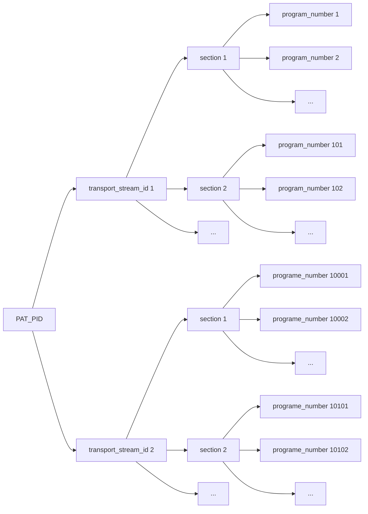
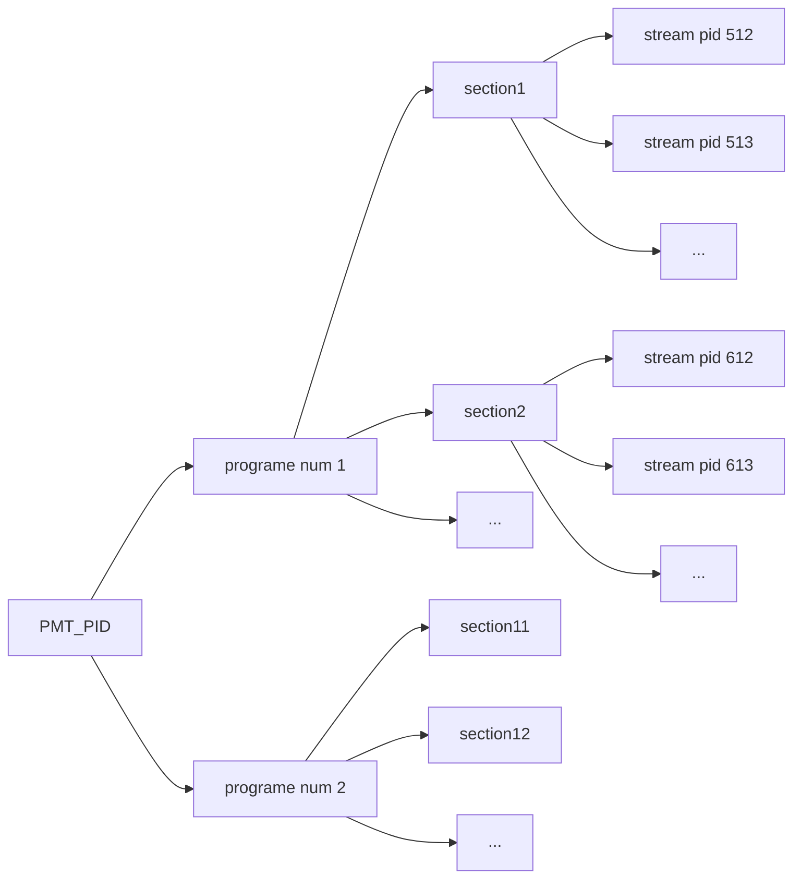

# PES

*   PES是对ES流的一层封装，主要的功能是使ES能够按顺序排列--打上时间戳。
*   打包视频时，一个pes包包含一个视频帧，如果一帧由多个nal组成，那么一个pes包含多个nal
*   打包音频时，一般一个pes包为一个音频帧，也可能一个pes包有多个音频帧

## 包头结构

14或者19个字节

| 名称                | 字节 | 含义                         |
| ----------------- | -- | -------------------------------- |
| pes start code    | 3B | 0x00 00 01                       |
| stream id         | 1B | 音频通常0xc0，视频通常0xe0       |
| pes packet length | 1B | 后面pes数据的长度，0表示不限制   |
| flag              | 1B |                                  |
| flag              | 1B | 取值0x80表示只含有PTS，取值0xc0表示含有pts和dts |
| pes data length   | 1B | 后面数据的长度，根据有无dts，取值5或10        |
| pts               | 5B | 33bit值                          |
| dts               | 5B | 33bit值                          |

## 生成包头

```c
void generatePesHeader()
{
// 14 or 19 bytes
    if(dts == pts){
    pts_dts_flag = 0x02;
    pes_header_data_length = 5;
    }
    else{
        pts_dts_flag = 0x03;
        pes_header_data_length = 10;
    }
    header[0] = 0x00;
    header[1] = 0x00;
    header[2] = 0x01;
    header[3] = stream_id; // 0xe0:video 0xc0:audio
    header[4] = (pes_packet_length >> 8) & 0xff; // 0代表不限
    header[5] = pes_packet_length & 0xff;
    header[6] = ( 1 << 7)               // must be one  1.......
                | ( 0 << 6)             // must be zero .0......
                | ((scrambling_control & 0x03) << 4)    //..xx....
                | ((priority & 0x01) << 3)     //....x...
                | ((data_alignment & 0x01) << 2)    //.....x..
                | ((copyright & 0x01) << 1) //......x.
                | (original & 0x01);    //.......x
    header[7] = (pts_dts_flag << 7)     //pts: x.......     dts: .x......
                | ((user_data);     //..xxxxxx
    header[8] = pes_header_data_length; //5 or 10
    // pts:33 bits
    // ....xxx1 xxxxxxxx xxxxxxx1 xxxxxxxx xxxxxxx1
    header[9] = (pts_dts_flag << 4) | (((pts >> 30) & 0x07) << 1) | 0x01;
    header[10] = (pts >> 22) & 0xff;
    header[11] = ((pts >> 15) & 0x7f) << 1) | 0x01;
    header[12] = (pts >> 7) & 0xff;
    header[13] = ((pts & 0x7f) << 1) | 0x01;
    if(pts_dts_flag & 0x01){
        header[14] = (0x01 << 4) | (((dts >> 30) & 0x07) << 1) | 0x01;
        header[15] = (dts >> 22) & 0xff;
        header[16] = ((dts >> 15) & 0x7f) << 1) | 0x01;
        header[17] = (dts >> 7) & 0xff;
        header[18] = ((dts & 0x7f) << 1) | 0x01;
    }
}
```

## 解析包头

```c
pts = ((int64_t(header[9] & 0x0e) << 32) >> 3) 
    + ((int64_t(header[13] & 0xff) << 24) >> 2) 
    + ((int64_t(header[14] & 0xfe) << 16) >> 2) 
    + ((int64_t(header[15]) << 8) >> 1) 
    + (int64_t(header[16] & 0xfe) >> 1);
```

# TS

## 包头格式

4字节

| 名称 | 长度  | 含义  |
| ------- | ------- | ------ |
| **sync_byte** | 8 bits  | 同步字节，固定为0x47   |
| transport_error_indicator | 1 bit   | 错误指示信息（1：该包至少有1bits传输错误）错误将丢弃此包 |
| payload_unit_start_indicator | 1 bit   |负载单元开始标志（packet不满188字节时需填充）。<br>当TS包带有PES包数据时，payload_unit_start_indicator具有以下特点：置为1，表示TS包的有效净荷以PES包的第一个字节开始；置为0，表示荷载不是PES包的开始。<br>当TS包带有PSI数据时，payload_unit_start_indicator具有以下特点：置为1，表示TS包带有PSI部分的第一个字节，即第一个字节带有指针pointer_field；置为0，表示TS包不带有一个PSI部分的第一个字节，即在有效净荷中没有指针pointer_field。对于空包的包，payload_unit_start_indicator应该置为0。|
| transport_priority | 1bit  | 传输优先级。当设置为“1”时，它表示关联的包比其他具有相同PID的没有位设置为“1”的包具有更大的优先级。  |
| **PID** | 13bits  | Packet ID，唯一的号码对应不同的包。<br>0x0000保留给PAT，0x0001保留给CAT。<br>0x0002-0x000F被保留。<br>0x0010-0x1FFF留给NIT、PMT、ES等。<br>0x1FFF表示空包。  |
| transport_scrambling_control  | 2bits   |加密标志（00：未加密；其他表示已加密）|
| adaptation_field_control  | 2bits  | 自适应控制 <br>00：保留未来使用。<br>01：负载中只有有效载荷。<br>10：负载中只有自适应字段。<br>11：先有自适应字段，再有有效载荷。 |
| **continuity\_counter**  | 4bits  | 相同PID的TS包，cc递增。<br>当adaptation_field_control为`00`或`10`时，cc不增加。<br>当包重复时，cc不增加。<br>discontinuity_indicator被设置为1时，cc不增加。<br>空包时，pid为0x1FFF，cc可不增加。 |
| adaption_field |  | 取决于adaptation_field_control字段的值 |

```c
transport_packet(){
    sync_byte                               8 bslbf
    transport_error_indicator               1 bslbf
    payload_unit_start_indicator            1 bslbf
    transport_priority                      1 bslbf
    PID                                     13 uimsbf
    transport_scrambling_control            2 bslbf
    adaptation_field_control                2 bslbf
    continuity_counter                      4 uimsbf
    if(adaptation_field_control=='10' || adaptation_field_control=='11'){
        adaptation_field()
    }
    if(adaptation_field_control=='01' || adaptation_field_control=='11') {
        for (i=0;i<N;i++){
            data_byte                       8 bslbf
        }
    }
}
```

## 解析包头

```c
void parseTsHeader()
{
    // 4 bytes
    uint8_t ts[188];
    file.read(ts, sizeof(ts));
    uint8_t sync_bytes = ts[0];                         //0x47 
    int is_start = ts[1] & 0x40;                        //.x......   payload_unit_start_indicator
    uint16_t pid = ((ts[1] & 0x1f) << 4) | ts[2];       //...xxxxx xxxxxxxx  13bits
    uint32_t continuity_counter = (ts[3] & 0x0f);       //....xxxx  4bits 0-15
}
```
ff中对应每一个PID有一个filter结构体

```c
struct MpegTSFilter {
    int pid;
    int es_id;
    int last_cc; /* last cc code (-1 if first packet) */
    int64_t last_pcr;
    int discard;
    enum MpegTSFilterType type;
    union {
        MpegTSPESFilter pes_filter;
        MpegTSSectionFilter section_filter;
    } u;
};
```

ff中判断cc是否正常：

```c
is_discontinuity = has_adaptation &&
                   packet[4] != 0 && /* with length > 0 */
                   (packet[5] & 0x80); /* and discontinuity indicated */
                   
cc_ok = pid == 0x1FFF || // null packet PID
        is_discontinuity ||
        tss->last_cc < 0 ||
        expected_cc == cc;
```

## PSI表(Program Specific Information)
1. Program Association Table (PAT)
2. TS Program Map Table (PMT)
3. Network Information Table (NIT)
4. Conditional Access Table (CAT)
ISO 13818-1

### 表的ID

|表       | pid     |  table ids | 含义 |
| ------- | --------| ---------- | ---- |
| PAT     | 0x00 00 |  0x00      | 节目关联表，解析流的开始 |
| CAT     | 0x00 01 |  0x01      | 条件接受表 |
| PMT     | 0x01 00 |  0x02      | 节目映射表，存放一个节目中各个流的映射关系
| SDT     | 0x00 11 |  0x42      | 属于SI标准     |

- pmt的pid一般从`0x01 00`开始，不一定只有一个

##### 在ffmpeg的mpegts.h中的PID定义

```c
/* pids */
#define PAT_PID         0x0000 /* Program Association Table */
#define CAT_PID         0x0001 /* Conditional Access Table */
#define TSDT_PID        0x0002 /* Transport Stream Description Table */
#define IPMP_PID        0x0003
/* PID from 0x0004 to 0x000F are reserved */
#define NIT_PID         0x0010 /* Network Information Table */
#define SDT_PID         0x0011 /* Service Description Table */
#define BAT_PID         0x0011 /* Bouquet Association Table */
#define EIT_PID         0x0012 /* Event Information Table */
#define RST_PID         0x0013 /* Running Status Table */
#define TDT_PID         0x0014 /* Time and Date Table */
#define TOT_PID         0x0014
#define NET_SYNC_PID    0x0015
#define RNT_PID         0x0016 /* RAR Notification Table */
/* PID from 0x0017 to 0x001B are reserved for future use */
/* PID value 0x001C allocated to link-local inband signalling shall not be
 * used on any broadcast signals. It shall only be used between devices in a
 * controlled environment. */
#define LINK_LOCAL_PID  0x001C
#define MEASUREMENT_PID 0x001D
#define DIT_PID         0x001E /* Discontinuity Information Table */
#define SIT_PID         0x001F /* Selection Information Table */
/* PID from 0x0020 to 0x1FFA may be assigned as needed to PMT, elementary
 * streams and other data tables */
#define FIRST_OTHER_PID 0x0020
#define  LAST_OTHER_PID 0x1FFA
/* PID 0x1FFB is used by DigiCipher 2/ATSC MGT metadata */
/* PID from 0x1FFC to 0x1FFE may be assigned as needed to PMT, elementary
 * streams and other data tables */
#define NULL_PID        0x1FFF /* Null packet (used for fixed bandwidth padding) */

/* m2ts pids */
#define M2TS_PMT_PID                      0x0100
#define M2TS_PCR_PID                      0x1001
#define M2TS_VIDEO_PID                    0x1011
#define M2TS_AUDIO_START_PID              0x1100
#define M2TS_PGSSUB_START_PID             0x1200
#define M2TS_TEXTSUB_PID                  0x1800
#define M2TS_SECONDARY_AUDIO_START_PID    0x1A00
#define M2TS_SECONDARY_VIDEO_START_PID    0x1B00
```

##### 在ffmpeg的mpegts.h中的Table ID定义

```c
/* table ids */
#define PAT_TID         0x00 /* Program Association section */
#define CAT_TID         0x01 /* Conditional Access section */
#define PMT_TID         0x02 /* Program Map section */
#define TSDT_TID        0x03 /* Transport Stream Description section */
/* TID from 0x04 to 0x3F are reserved */
#define M4OD_TID        0x05
#define NIT_TID         0x40 /* Network Information section - actual network */
#define ONIT_TID        0x41 /* Network Information section - other network */
#define SDT_TID         0x42 /* Service Description section - actual TS */
/* TID from 0x43 to 0x45 are reserved for future use */
#define OSDT_TID        0x46 /* Service Descrition section - other TS */
/* TID from 0x47 to 0x49 are reserved for future use */
#define BAT_TID         0x4A /* Bouquet Association section */
#define UNT_TID         0x4B /* Update Notification Table section */
#define DFI_TID         0x4C /* Downloadable Font Info section */
/* TID 0x4D is reserved for future use */
#define EIT_TID         0x4E /* Event Information section - actual TS */
#define OEIT_TID        0x4F /* Event Information section - other TS */
#define EITS_START_TID  0x50 /* Event Information section schedule - actual TS */
#define EITS_END_TID    0x5F /* Event Information section schedule - actual TS */
#define OEITS_START_TID 0x60 /* Event Information section schedule - other TS */
#define OEITS_END_TID   0x6F /* Event Information section schedule - other TS */
#define TDT_TID         0x70 /* Time Date section */
#define RST_TID         0x71 /* Running Status section */
#define ST_TID          0x72 /* Stuffing section */
#define TOT_TID         0x73 /* Time Offset section */
#define AIT_TID         0x74 /* Application Inforamtion section */
#define CT_TID          0x75 /* Container section */
#define RCT_TID         0x76 /* Related Content section */
#define CIT_TID         0x77 /* Content Identifier section */
#define MPE_FEC_TID     0x78 /* MPE-FEC section */
#define RPNT_TID        0x79 /* Resolution Provider Notification section */
#define MPE_IFEC_TID    0x7A /* MPE-IFEC section */
#define PROTMT_TID      0x7B /* Protection Message section */
/* TID from 0x7C to 0x7D are reserved for future use */
#define DIT_TID         0x7E /* Discontinuity Information section */
#define SIT_TID         0x7F /* Selection Information section */
```

### 解析表头
PSI表可以被划分为最多256个`section`，每个`section`所携带的`section length`最大不超过1021，因为`section length`及其前面还有3个字节，因此`section`的总长度不能超过1021+3=1024。
在ff中每一个表都有一个`SectionFilter`结构体对应。

```c
typedef struct MpegTSSectionFilter {
    int section_index;
    int section_h_size;
    int last_ver;
    unsigned crc;
    unsigned last_crc;
    uint8_t *section_buf;
    unsigned int check_crc : 1;
    unsigned int end_of_section_reached : 1;
    SectionCallback *section_cb;
    void *opaque;
} MpegTSSectionFilter;
```

每个`section`都有自己的`SectionHeader`，当一个`section`分散在多个`TS`包中传输时，也就是`TS`包携带了`section`的第一个字节时，此`TS`包在`PSI section`开始前会有一个`pointer_field`，通常为`0x00`，并且此包拥有`SectionHeader`的信息。

```c
typedef struct SectionHeader {
    uint8_t tid;            // table_id
    uint16_t id;            // 对于PAT是transport_stream_id，对于PMT是program_number
    uint8_t version;        
    uint8_t current_next;   // 当前/后续指示符
    uint8_t sec_num;        // section_number 当前section的段号
    uint8_t last_sec_num;   // 最后section的段号
} SectionHeader;

static int parse_section_header(SectionHeader *h, const uint8_t **pp, const uint8_t *p_end)
{
    int val;

    val = get8(pp, p_end);
    if (val < 0)
        return val;
    h->tid = val;
    *pp += 2;
    val  = get16(pp, p_end);
    if (val < 0)
        return val;
    h->id = val;
    val = get8(pp, p_end);
    if (val < 0)
        return val;
    h->version = (val >> 1) & 0x1f;
    h->current_next = val & 0x01;
    val = get8(pp, p_end);
    if (val < 0)
        return val; 
    h->sec_num = val;
    val = get8(pp, p_end);
    if (val < 0)
        return val;
    h->last_sec_num = val;
    return 0;
}
```

### PAT
一个PAT表可以分段成最多256个section进行传输，每个section都承载了一部分节目信息



```c
struct PatProgram
{
    program_number :16;         //节目号
    reserved :3;    
    union{
        network_PID :13;       //网络信息表（NIT）的PID,节目号为0时对应的PID为network_PID
        program_map_PID :13;   //节目映射表的PID，节目号大于0时对应的PID，每个节目对应一个
    }pid;
};

struct PatSection 
{ 
    table_id :8;            //固定为0x00，标志是该表是PAT表
    section_syntax_indicator :1;    //段语法标志位，固定为1
    zero :1;                //0
    reserved :2;          //保留位 
    section_length :12;     // 表示从下一个字段开始到CRC32(含)之间有用的字节数，本section的总长度，最大不超过1021.
    transport_stream_id :16;        //该传输流的ID，区别于一个网络中其它多路复用的流
    reserved :2;      //保留位
    version_number :5;      //范围0-31，表示PAT的版本号
    current_next_indicator :1;      //发送的PAT是当前有效还是下一个PAT有效
    section_number :8;      //  分段的号码。PAT可能分为多段传输，第一段为00，以后每个分段加1，最多可能有256个分段
    last_section_number :8;     // 指定PAT最后一个section的编号。
    vector<PatProgram> programs;
    CRC_32:32;         //CRC32校验码，与version_number一起用于判断pat表是否变化
};
```

### PMT
一个PMT表可能分段成多个section进行传输，同时相同的PMT_PID可能承载了不同的program_num信息。



```c
struct PmtStream
{
    stream_type : 8;     // 指示特定PID的节目元素包的类型。该处PID由elementary PID指定
    reserved : 3;        // 0x07
    elementary_PID : 13; // 该域指示TS包的PID值。这些TS包含有相关的节目元素
    reserved : 4         // 0x0F
    ES_info_length : 12; // 前两位bit为00。该字段指示跟随其后的descriptors的字节数
    vector<descriptor> descriptors;
};

struct PmtSection
{
    table_id : 8;                 // 固定为0x02, 表示PMT表
    section_syntax_indicator : 1; // 固定为0x01
    zero : 1;                     // 0x01
    reserved : 2;                 // 0x03
    section_length : 12;          // 首先两位bit置为00，它指示段的byte数，由段长度域开始，包含CRC
    program_number : 16;          // 节目号
    reserved : 2;                 // 0x03
    version_number : 5;           // 指出TS流中Program map section的版本号
    current_next_indicator : 1;   // 当该位置1时，当前传送的Program map section可用
                                  // 当该位置0时，指示当前传送的Program map section不可用，下一个TS流的Program map section有效
    section_number : 8;           // 给出此section的编号。第一个section为0x00，后续递增1。
    last_section_number : 8;      // 指定PMT最后一个section的编号。
    reserved : 3;        
    PCR_PID : 13;                 // 指明TS包的PID值，该TS包含有PCR域，
                                  // 该PCR值对应于由节目号指定的对应节cd 目，如果对于私有数据流的节目定义与PCR无关，这个域的值将为0x1FFF。
    reserved : 4;                 // 预留为0x0F
    program_info_length : 12;     // 前两位bit为00。该字段指出跟随其后的对节目信息进行描述的descriptors的字节数。
    vector<descriptor> descriptors;
    vector<PmtStream> components; 
    CRC_32 : 32;                  // 32位校验信息，对全部的TS program map section进行处理后计算得到
};
```

##### 在ffmpeg的mpegts.h中的stream_type定义

```c
#define STREAM_TYPE_VIDEO_MPEG1     0x01
#define STREAM_TYPE_VIDEO_MPEG2     0x02
#define STREAM_TYPE_AUDIO_MPEG1     0x03
#define STREAM_TYPE_AUDIO_MPEG2     0x04
#define STREAM_TYPE_PRIVATE_SECTION 0x05
#define STREAM_TYPE_PRIVATE_DATA    0x06
#define STREAM_TYPE_AUDIO_AAC       0x0f
#define STREAM_TYPE_AUDIO_AAC_LATM  0x11
#define STREAM_TYPE_VIDEO_MPEG4     0x10
#define STREAM_TYPE_METADATA        0x15
#define STREAM_TYPE_VIDEO_H264      0x1b
#define STREAM_TYPE_VIDEO_HEVC      0x24
#define STREAM_TYPE_VIDEO_CAVS      0x42
#define STREAM_TYPE_VIDEO_AVS2      0xd2
#define STREAM_TYPE_VIDEO_AVS3      0xd4
#define STREAM_TYPE_VIDEO_VC1       0xea
#define STREAM_TYPE_VIDEO_DIRAC     0xd1

#define STREAM_TYPE_AUDIO_AC3       0x81
#define STREAM_TYPE_AUDIO_DTS       0x82
#define STREAM_TYPE_AUDIO_TRUEHD    0x83
#define STREAM_TYPE_AUDIO_EAC3      0x87
```

## SI表

### SDT表(现行传送流业务描述段)

```c
for (;;) {
        sid = get16(&p, p_end);
        if (sid < 0)
            break;
        val = get8(&p, p_end);
        if (val < 0)
            break;
        desc_list_len = get16(&p, p_end);
        if (desc_list_len < 0)
            break;
        desc_list_len &= 0xfff;
        desc_list_end  = p + desc_list_len;
        if (desc_list_end > p_end)
            break;
        for (;;) {
            desc_tag = get8(&p, desc_list_end);
            if (desc_tag < 0)
                break;
            desc_len = get8(&p, desc_list_end);
            desc_end = p + desc_len;
            if (desc_len < 0 || desc_end > desc_list_end)
                break;

            av_log(ts->stream, AV_LOG_TRACE, "tag: 0x%02x len=%d\n",
                    desc_tag, desc_len);

            switch (desc_tag) {
            case 0x48:
                service_type = get8(&p, desc_end);
                if (service_type < 0)
                    break;
                provider_name = getstr8(&p, desc_end);
                if (!provider_name)
                    break;
                name = getstr8(&p, desc_end);
                if (name) {
                    AVProgram *program = av_new_program(ts->stream, sid);
                    if (program) {
                    // SDT记录的 主要信息
                        av_dict_set(&program->metadata, "service_name", name, 0);       
                        av_dict_set(&program->metadata, "service_provider",
                                    provider_name, 0);
                    }
                }
                av_free(name);
                av_free(provider_name);
                break;
            default:
                break;
            }
            p = desc_end;
        }
        p = desc_list_end;
    }
```

